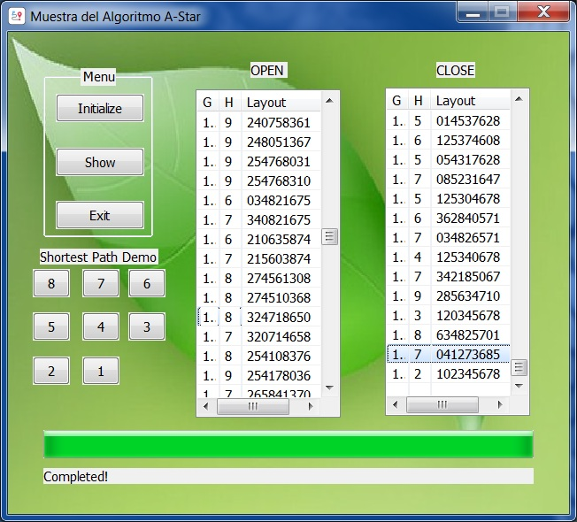

# Heuristic A-Star Algorithm MFC Demo

## Overview

This MFC application demonstrates the A* search algorithm by solving a 3x3 sliding puzzle. The program initializes the puzzle, runs the A* algorithm to find a solution, and visually updates the user interface to show the progress and final result.

## Features

- **Sliding Puzzle**: A 3x3 grid where the objective is to arrange numbered tiles by sliding them into the empty space.
- **A* Algorithm Implementation**: Utilizes a priority queue to efficiently find the shortest path to the solution based on heuristic and cost values.
- **Visual Feedback**: Displays the current state of the open and closed lists, as well as a progress bar during algorithm execution.
- **Dynamic Initialization**: Randomly shuffles the initial puzzle state and checks if a solution is possible.

## Algorithm Logic

1. **Node Representation**: Each puzzle state is represented as a `Node` class containing the state of the puzzle, heuristic value (`h`), cost from the start (`g`), and position of the empty tile.
2. **Initialization**: Upon clicking the initialize button, the program generates a random valid state for the puzzle and prepares the necessary data structures for the A* algorithm.
3. **A* Search**:
   - The algorithm begins by adding the initial state to the open list.
   - It repeatedly selects the node with the lowest cost from the open list, expands it, and adds its valid successors to the open list.
   - The process continues until the goal state is reached or the open list is empty.
4. **Solution Visualization**: If a solution is found, the path is reconstructed and displayed step-by-step in the UI.

## Screenshots
